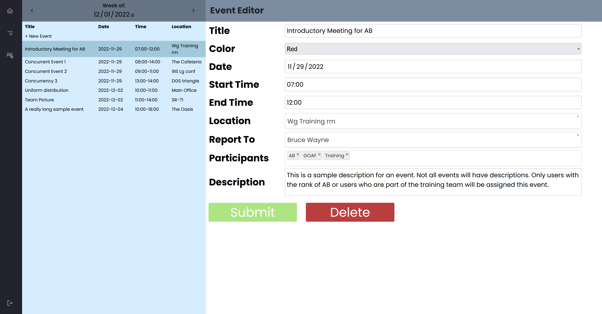
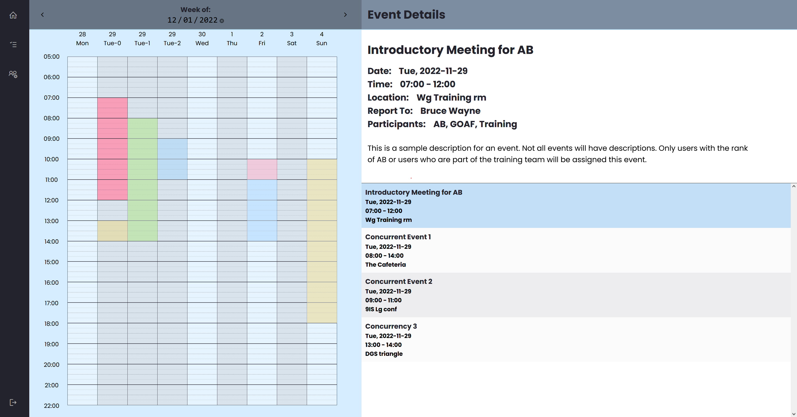
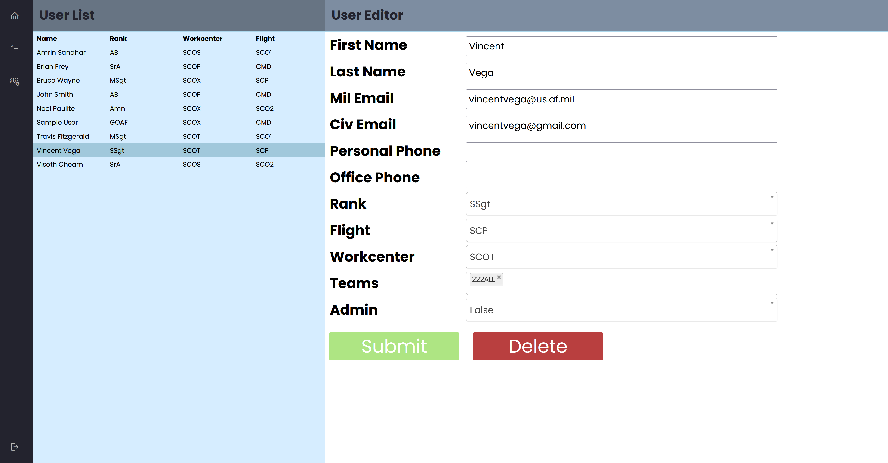
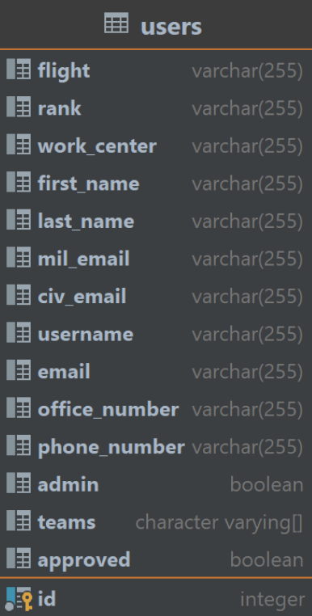
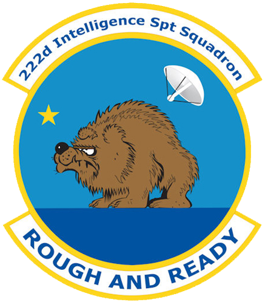

# TaskTracker222
### Team: P.C.B.A.L.F

## Team Members:
*   Thomas Jaramillo-Ochoa: thomasjaramillo@csus.edu
*   Ian Shultz: irshultz@csus.edu
*   Soua Chang: schang@csus.edu
*   Nicholas Burt: nburt@csus.edu
*   Christopher Gonsalves: cgonsalves2@csus.edu
*   Dante Rodriguez: danterodruguez@csus.edu
*   Steven Trinh: steventrinh@csus.edu
*   Andrew Xiong: andrewxiong@csus.edu

#### Synopsis:
Task Tracker 222 is a platform designed to do exactly what it sounds like: track tasks. Users can easily view scheduled tasks/drills along with time, location, and other important details, making it a breeze to keep track of everything. Administrators can create, edit, and delete drills with ease, approve or deny new accounts, and edit or delete existing accounts as necessary.

To ensure the security of the app and its users, Task Tracker 222 implements Amazon Web Service Cognito and RDS. This means that data is stored securely and personal information is protected.

#### Testing:
- Unit tests implementing JUnit 5 framework are included for each class.
- There is a System Test Report from earlier developers that details manual testing done on the application.
- No additional testing was implemented during this semester.

#### Deployment:
- To run this app, ensure that there are active instances of Amazon Cognito, ISW, and a PostgreSQL RDS set up. Collect the following variables and add them to the Task Tracker environment variables:

**ACCESS_KEY:**  
IAM -> Users -> Security Credentials

**AWS_REGION:**  
Cognito -> General Settings

**CLIENT_SECRET:**  
Cognito -> App Clients -> Show Details

**COGNITO_CLIENT_ID:**  
Cognito -> App Clients -> Show Details

**COGNITO_CLIENT_NAME:**  
Cognito -> App Clients -> Show Details

**COGNITO_ISSUER_URI:**  
The endpoint from the **DATABASE_URL** below and the Cognito pool ID in this format: https://{endpoint}/{pool-id}

**DATABASE_PASSWORD:**  
RDS -> Database Name -> Modify -> New Master Password

**DATABASE_URL:**  
Follow this format: `jdbc:postgresql://{Endpoint}:{PortNumber}/{DB name}`, where Endpoint and Port Number can be found in `RDS -> Database -> Connectivity & Security`. For example: `jdbc:postgresql://tasktracker.ciw3zlwjelrb.us-west-1.rds.amazonaws.com:5432/TaskTracker`.

**DATABASE_USERNAME:**
    
**SECRET_KEY:**
    
**SUBDOMAIN:**
    
**USER_POOL_ID:**  
RDS -> Database -> Database Name -> Configuration.

Additional instructions for deployment can be found in the TT222_User_Manual.pdf.

#### Developers:
Find additional troubleshooting and configuration information in the included TT222_Maintenance_Manual.pdf.

#### Images of UI:

#### Logo of the 222nd Intelligence Squadron:

#### Timeline:
In the Fall of 2023, the following enhancements are planned:
- Two-factor authentication with authenticator apps and SMS messaging.
- Improvements to UI with a focus on use on mobile devices.
- Integration with third-party calendar applications such as Microsoft Teams, iCal, and Outlook, enabling syncing of scheduled drills and events.
