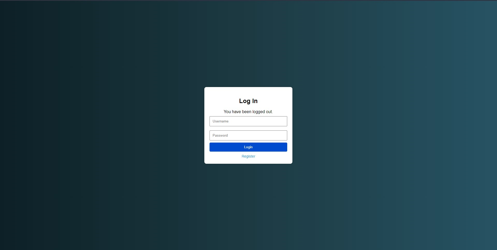
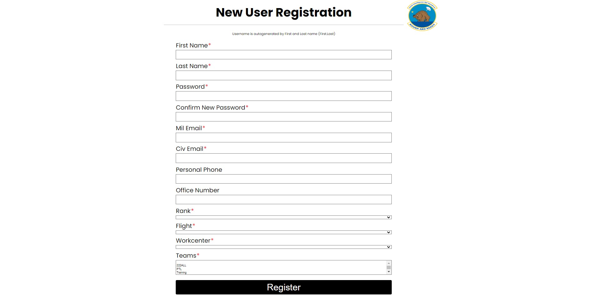
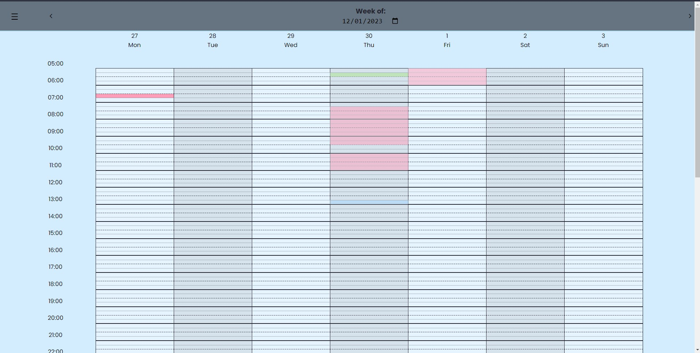
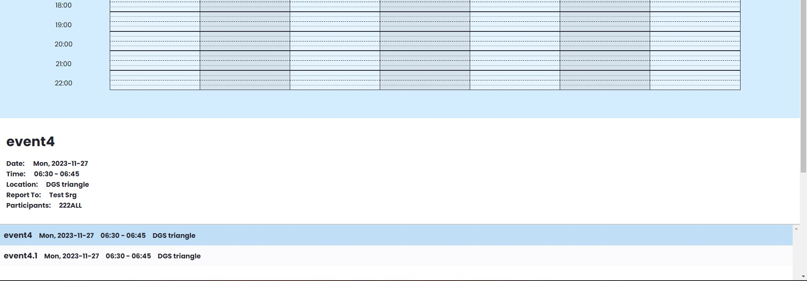
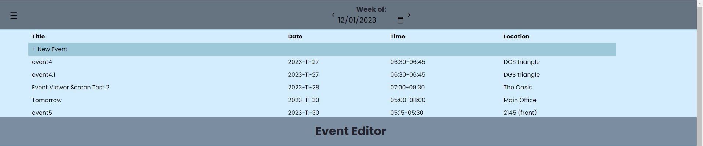
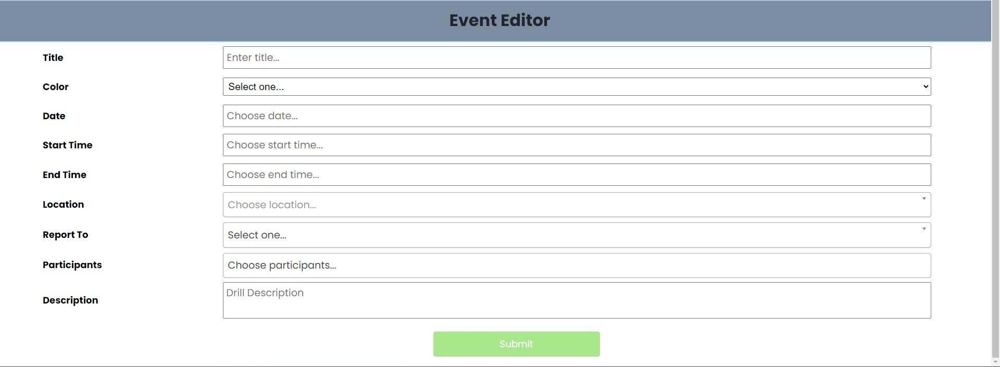
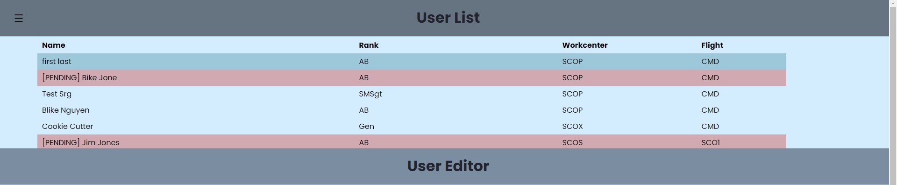
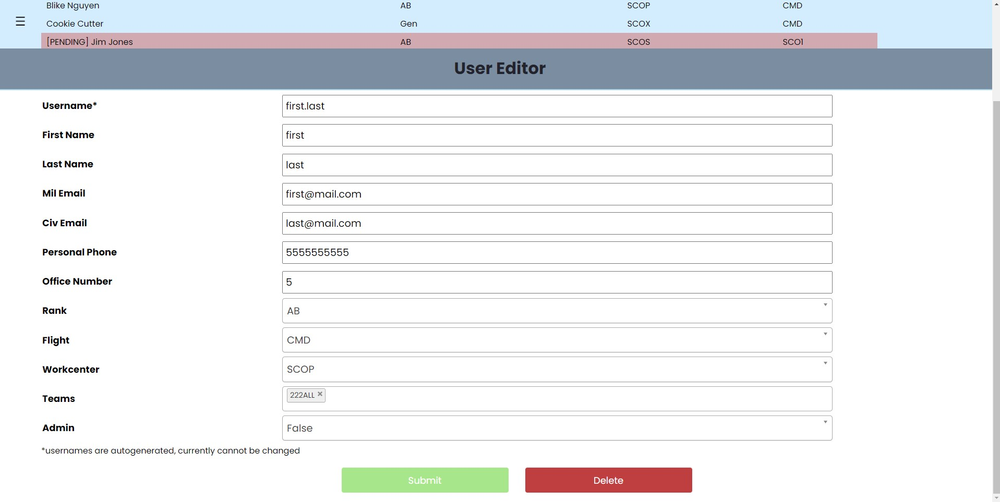

# TaskTracker222
### Team: P.C.B.A.L.F
### Plain Cheese Burger and Large Fries

## Team Members:
*   Thomas Jaramillo-Ochoa: thomasjaramillo@csus.edu
*   Ian Schultz: irschultz@csus.edu
*   Soua Chang: schang@csus.edu
*   Nicholas Burt: nburt@csus.edu
*   Christopher Gonsalves: cgonsalves2@csus.edu
*   Dante Rodriguez: danterodriguez@csus.edu
*   Steven Trinh: steventrinh@csus.edu
*   Andrew Xiong: andrewxiong@csus.edu

#### Synopsis:
The TaskTracker application allows users to log into the application and track tasks through a calendar which administrative users can schedule and modify. 
If a user wishes to view their tasks, all they need to do is login and view the calendar.

To ensure the security of the app and its users, Task Tracker 222 implements uses Bcrypt for password encryption and built-in Spring Boot user authentication. 
This means that data is stored securely and personal information is protected.

#### Testing:
- Unit tests implementing JUnit 5 framework are included for each class.
- There is a System Test Report which highlights various functions within our application

#### Deployment:
- This application is intended to be run from a Docker container, but can also be run through an IDE such as Intelij Idea. 
- To run from with Docker, place project jar file in a folder with 
- To run from the IDE open the most recent build and set environment variables then run the application
Both of these deployments should be run on localhost8080

**DATABASE_PASSWORD:**  
Set up when deploying PostgreQL database.

**DATABASE_URL:**  
Follow this format: `jdbc:postgresql://{Endpoint}:{PortNumber}/{DB name}`.
For example: `jdbc:postgresql://localhost:5432/postgres`.

**DATABASE_USERNAME:**
This is set when your first create your database.

Additional instructions for deployment can be found in the "User Manual.pdf".

#### Developers:
Find additional troubleshooting and configuration information in the included TT222_Maintenance_Manual.pdf.

#### Images of UI:

#### Logo of the 222nd Intelligence Squadron:

### Timeline:
In the Fall of 2023, the following enhancements have been completed:
#### Major Changes:
- Redesigned all User Interface pages with a focus on mobile device use.
- Decoupled the application from any Amazon Web Services (AWS) by using built-in Spring Boot Authentication and hosting a local instance of PostgresQL database.
- Containerized application to be run from a Docker file on a Linux environment to ensure 100% up-time.
#### Minor changes:
- Added a method to auto-generate usernames.
- Added additional fields to User registration to verify Passwords.
- Newly registered users will be forwarded to pending approval page.
- Duplicate usernames cannot be registered.
- Admins have the ability to modify usernames.